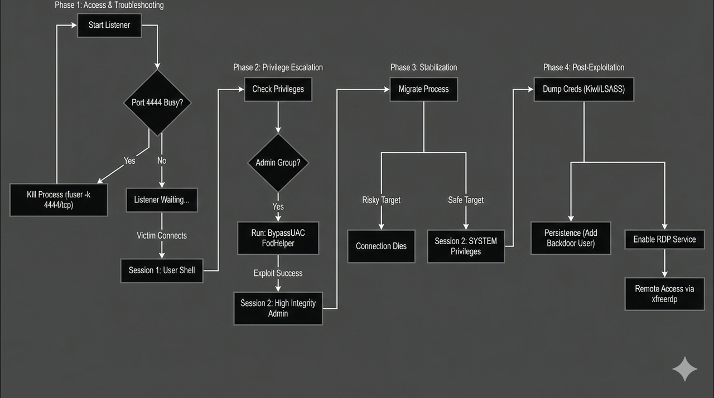

# 🛡️ Pen-sec: Windows Privilege Escalation Automation

> **Automating the Cyber Kill Chain: From Foothold to Domain Dominance.**
> *A Proof-of-Concept for educational purposes and authorized Red Team engagements.*

  

## 🚨 Legal Disclaimer
**Please read carefully:**
This repository contains scripts and techniques used for **authorized penetration testing** and educational research only. I created this project to demonstrate understanding of Windows security architecture, UAC bypass techniques, and post-exploitation workflows.
* **Do not** use this against networks or systems you do not own or have explicit permission to test.
* The author is not responsible for any misuse or damage caused by this tool.

---

## 📖 Project Overview
In modern Red Teaming, speed and stability are everything. Manually typing commands during a high-stress engagement leads to typos, missed opportunities, and detection.

**Pen-sec** is an automation workflow (Resource Script) that streamlines the Windows Privilege Escalation phase. It turns a fragile, low-privilege foothold into a stable, System-level persistent session in seconds.

### 🎯 Key Capabilities
* **UAC Bypass:** Leveraging the 'FodHelper' registry technique to elevate privileges without user interaction.
* **Smart Stabilization:** automatically identifies safe system processes (like `spoolsv.exe` or `winlogon.exe`) to migrate into, preventing session death.
* **Credential Harvesting:** Automated dumping of SAM database and NTLM hashes via Kiwi (Mimikatz).
* **Persistence:** Establishing RDP backdoors and local admin accounts for re-entry.

---

## 📊 The Attack Flowchart
*Visualizing the logic behind the automation.*


*(Make sure to upload your image and name it flowchart.png)*

---

## 🛠️ Technical Breakdown

### Phase 1: The Bypass (FodHelper)
Standard users in the "Admin" group are often restricted by UAC. This script abuses the Windows Feature on Demand Helper (`fodhelper.exe`) to execute commands in a High Integrity context, bypassing the prompt completely.

### Phase 2: The Migration (The "Golden Ticket")
A High Integrity shell is volatile. The script stabilizes access by migrating the payload into **System-level processes**.
* **Why `winlogon.exe`?** It runs as `NT AUTHORITY\SYSTEM` and is critical to the OS, making it a stable home for our beacon.

### Phase 3: Post-Exploitation
Once `SYSTEM` access is confirmed, the script executes the "loot" phase:
1.  **Dumps Hashes:** Extracts NTLM hashes for offline cracking.
2.  **Enables RDP:** Modifies registry keys to allow remote desktop connections.
3.  **Cleanup:** Wipes Windows Event Logs (`clearev`) to minimize the forensic footprint.

---

## 🚀 Usage

### Prerequisites
* **Kali Linux** (or any pentesting distro)
* **Metasploit Framework** installed

### Installation
1.  Clone the repository:
    ```bash
    git clone [https://github.com/meet-the-1337/Pen-sec.git](https://github.com/meet-the-1337/Pen-sec.git)
    cd Pen-sec
    ```

2.  Run the automation script in Metasploit:
    ```bash
    # Assuming you have an active session (Session 1)
    msfconsole -r automated_privesc.rc
    ```

---

## 🤝 Contributing
This project is open-source under the **MIT License**.
If you have a better way to handle the migration logic or a cleaner persistence method, feel free to fork the repo and submit a Pull Request!

---

*Created by [meet-the-1337](https://github.com/meet-the-1337) | Cybersecurity Enthusiast & Red Teamer*
